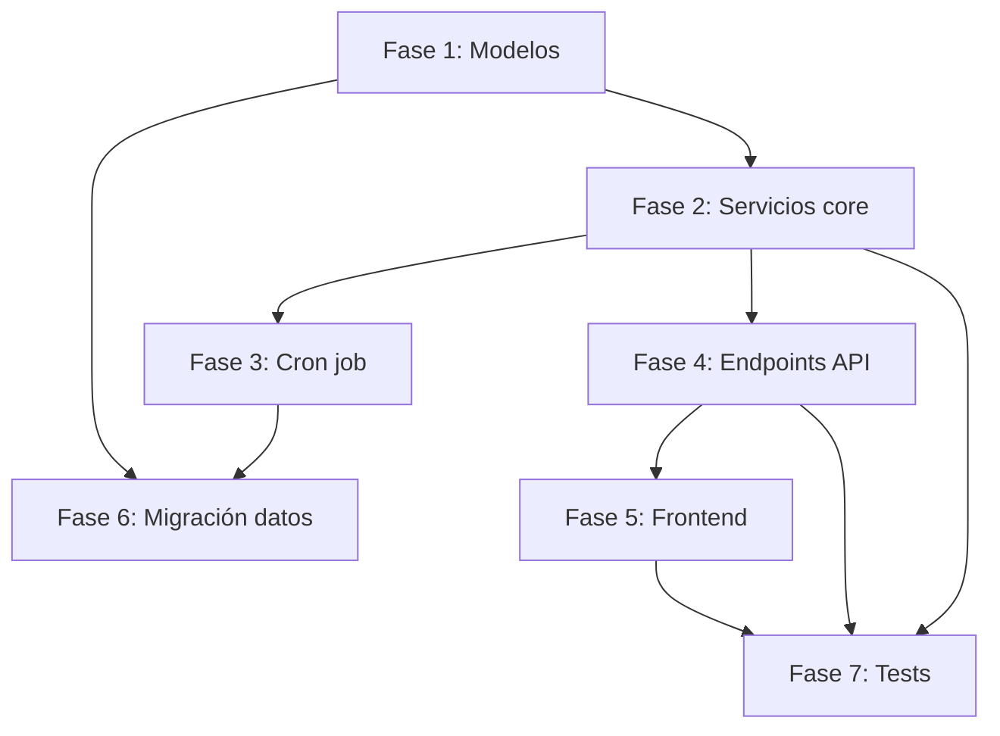

# PROPUESTA TÉCNICA R3 — Workflow de Revisión y Aprobación

> **Documento:** Propuesta completa para implementar Épica 3 (Workflow) + partes de Épica 4 (Control ETO) y Épica 8 (Monitoreo).
> **Basado en:** 83 páginas del PDF oficial de Historias de Usuario (8 Épicas, 40+ US) + código actual del monorepo (sesión 35, 22 tablas, 228 tests).
> **Fecha:** 2026-06-19
> **Autor:** Análisis técnico post-sesión 35

---

## Índice

1. [Diagnóstico de la BD actual para R3](#1-diagnóstico-de-la-bd-actual-para-r3)
2. [Propuesta de nuevas tablas](#2-propuesta-de-nuevas-tablas)
3. [Propuesta de eventos / lógica de negocio](#3-propuesta-de-eventos--lógica-de-negocio)
4. [Migración de JSONB a tablas N:M](#4-migración-de-jsonb-a-tablas-nm)
5. [Estimación de esfuerzo](#5-estimación-de-esfuerzo)
6. [Riesgos y mitigaciones](#6-riesgos-y-mitigaciones)

---

## 1. Diagnóstico de la BD actual para R3

### 1.1 ¿Por qué JSONB en `documento_flujo` NO es suficiente para US-3.01 y US-3.06?

El modelo `DocumentoFlujo` (creado en R2, sesión 21) guarda `revisor_ids` y `aprobador_ids` como columnas JSONB (`list[int]`). Esto fue explícitamente una decisión temporal documentada en ADR-042: *"JSONB para N:M en documento_flujo (tablas N:M en R3)"* y en el propio docstring del modelo (`documento_flujo.py:11-13`).

**Problema #1 — Sin estado individual por tarea:**
Con JSONB, no hay forma de saber si el revisor #3 ya aprobó o sigue pendiente. Todo el array `[1, 2, 3]` vive en una columna, y solo se puede preguntar "¿cuántos revisores hay?" no "¿cuál es el estado del revisor #3?". El endpoint `bandeja.py` ya sufre esto: líneas 155-167 cargan TODOS los documentos EN_REVISION y filtran en Python porque PostgreSQL no puede indexar dentro de un JSONB para match de usuario_id individual. Con 10 documentos es aceptable; con 500 es insostenible.

**Problema #2 — Sin SLA individual:**
US-3.01 exige semáforo por tarea individual: "Desde el día 0 hasta el día hábil 4 se marca en verde, desde el día hábil 5 hasta el 7 en amarillo, desde el 8 hasta el 10 en rojo". Cada revisor tiene su propio contador que arranca cuando la tarea le es asignada. Con JSONB no hay `fecha_asignacion` por revisor — solo la `fecha_solicitud` del flujo. Si un revisor es reasignado (US-3.06), su contador debe reiniciarse a 0, pero los otros revisores mantienen el suyo.

**Problema #3 — Sin reasignación trazable:**
US-3.06 dice: "Si una tarea lleva más de 10 días hábiles sin ser atendida, el sistema la quita del usuario moroso y la crea para su delegado". Con JSONB, "quitar" significa sacar un ID del array y "crear" significa agregar otro. No hay registro de que la tarea fue reasignada, ni quién era el usuario original, ni cuándo ocurrió. El timeline (bitácora) queda desacoplado de la tarea.

**Problema #4 — Sin corrección dirigida:**
US-3.04 y US-3.05 exigen que cuando un revisor observa, la tarea de corrección vaya SOLO a ese revisor (bypass directo). Con JSONB, si el revisor #2 observó, no hay forma de saber QUÉ revisor observó para devolverle la corrección. Habría que parsear la bitácora para inferirlo, lo cual es frágil.

**Problema #5 — Sin timeline por tarea:**
US-8.01 exige un timeline con colores por etapa (azul/verde/rojo/ámbar/gris) y nodos individuales. Con JSONB, cada acción de cada revisor/aprobador requiere una fila en bitácora, pero la bitácora actual no existe como tabla — solo está el `audit_log` que es genérico y no tiene concepto de "etapa de flujo".

### 1.2 Tablas actuales que están bien (no tocar)

| Tabla | Razón |
|---|---|
| `gerencias` | Catálogo puro, no requiere cambios |
| `areas` | Catálogo puro, FK a gerencia |
| `usuarios` | Ya tiene delegado, ausencias, roles. Solo agregar `jefe_id` (FK) cuando se implemente la cadena de mando (US-3.06 escenario B) |
| `roles` | Catálogo de 5 roles, OK |
| `usuario_roles` | N:M bien diseñada |
| `documentos` | Tabla core del documento, OK. Solo usarla como FK desde las nuevas tablas |
| `archivos_adjuntos` | Storage, OK |
| `estados` | Catálogo flexible con ContextoEstado, OK. Agregar nuevos estados TAREA si es necesario |
| `tipos_documento` | Catálogo, OK |
| `semaforizacion_tarea` | Configuración de SLA por tipo de tarea. **Bien diseñada pero con valores incorrectos** (ver abajo) |
| `configuracion_global` | Parámetros globales, OK |
| `feriados` | Para cálculo de días hábiles, OK |
| `firmas_digitales` | Log de 2FA, OK |
| `audit_log` | Auditoría general, OK |

### 1.3 Tablas actuales que hay que modificar

| Tabla | Cambio requerido |
|---|---|
| `documento_flujo` | **Migrar JSONB a tablas N:M**. Los campos `revisor_ids`, `aprobador_ids`, `alcance_difusion_ids`, `reemplaza_documento_ids` se eliminan. El resto del modelo (snapshots, firma metadata) se preserva. |
| `documento` | Agregar columna `estado_flujo` (EN_ELABORACION / LIBERACION_ETO / EN_REVISION / EN_CORRECCION / EN_APROBACION / APROBADO / VIGENTE / OBSOLETO / ELIMINADO) o usar la tabla `estados` con FK. Actualmente tiene `estatus` como enum limitado a 4 valores. |

### 1.4 La tabla `semaforizacion_tarea`: correctamente diseñada pero con datos incorrectos

El diseño es bueno: PK = `tipo_tarea` (4 valores fijos), columnas `dias_verde`, `dias_amarillo`, `dias_rojo`, `plazo_maximo_dias`. Sin embargo:

1. **Los valores actuales NO corresponden a US-3.01**:
   - Actual: REVISION tiene verde=7, amarillo=12, rojo=15 (plazo 15 días)
   - US-3.01 exige: verde=4, amarillo=7, rojo=10 (plazo 10 días hábiles)
   - El plazo de 10 días del PDF es **días hábiles**, no naturales. La tabla actual no distingue hábiles de naturales.

2. **No está conectada a ninguna tabla**: `semaforizacion_tarea` es un catálogo huérfano. Ninguna otra tabla tiene FK hacia ella. El cálculo del semáforo se hace en runtime en el frontend (o debería hacerse), pero no hay una tabla `tareas` que tenga `tipo_tarea` como FK para que el JOIN funcione.

3. **Faltan tipos de tarea**: US-3.01 agrega `LIBERACION` y `CORRECCION` como tipos de tarea que no están en el enum actual (`TipoTarea` solo tiene REVISION, APROBACION, CONTROL_LECTURA, EVALUACION).

**Conclusión**: La estructura de `semaforizacion_tarea` es sólida. Solo hay que:
- Agregar `LIBERACION` y `CORRECCION` al enum `TipoTarea`
- Actualizar los umbrales a los valores de US-3.01 (verde=4, amarillo=7, rojo=10) para REVISION y APROBACION
- Agregar flag `dias_habiles` para distinguir hábiles de naturales
- Crear la FK desde `tareas.tipo_tarea → semaforizacion_tarea.tipo_tarea`

### 1.5 R2 incompleto: lo que el wizard de creación aún no resuelve

> **⚠️ CRÍTICO:** La propuesta de R3 asume que R2 (wizard de creación de documentos) está 100% completo. **No lo está.** Estos 7 puntos deben resolverse antes o durante las primeras fases de R3, porque las tablas nuevas (`tareas`, `bitacora_timeline`, etc.) dependen de que el wizard genere datos correctos.

#### 1.5.1 Código del documento: separación de componentes

Actualmente el código del documento se genera como `CC-3-005/00` (código+versión). Pero el PDF especifica:

| Componente | Ejemplo | Dónde se guarda hoy |
|---|---|---|
| Sigla área | `CC` | `areas.sigla` ✅ |
| Código tipo | `7` (numérico, no sigla) | `tipos_documento.codigo` ✅ |
| Correlativo | `005` | `documentos.correlativo` ✅ |
| Versión | `00` | `documento_flujo.version_snapshot` ✅ |
| **Título** | `PROCEDIMIENTO DE MUESTREO` | `documentos.titulo` ✅ |
| **Nombre completo del documento** | `CC-7-005 PROCEDIMIENTO DE MUESTREO V00` | ❌ No se construye como string único. Hoy solo se muestra el código. |

**El problema:** El frontend muestra `CC-7-005` pero el PDF exige `CC-7-005 PROCEDIMIENTO DE MUESTREO V00`. El nombre completo debe generarse como string concatenado para:
- Nombre del archivo .docx principal
- Visualización en Bandeja, Lista Maestra y Consultas
- Carátula del documento (primera página del .docx)

**Fix necesario:** Agregar un helper `generar_nombre_completo(codigo, titulo, version)` que retorne `"CC-7-005 PROCEDIMIENTO DE MUESTREO V00"`.

#### 1.5.2 Actualización documental (solo cambia la versión)

El wizard actual solo permite **creación** de documentos. La US-2.xx exige también **actualización**:

**Flujo faltante:**
1. Usuario selecciona "Actualización" en `tipo_solicitud`
2. Aparece un selector desplegable que lista los documentos existentes filtrados por (área, tipo_documento)
3. Usuario selecciona el documento a actualizar → se autocompletan: código, título, versión anterior
4. El sistema calcula: `version_snapshot = version_anterior + 1`
5. El documento subido debe tener el MISMO código y título en su carátula

**Validación de carátula (importante):**
Cuando el usuario sube el archivo .docx (documento principal), el backend debe leer la primera página del .docx y verificar:
- El título en la carátula coincide con `documentos.titulo`
- El código coincide con `documentos.codigo`
- La versión coincide con `version_snapshot`

Si NO coincide: advertencia (no bloqueante). Si coincide: confirmación "Documento correcto".

**Columna nueva necesaria:**
```sql
ALTER TABLE documento_flujo ADD COLUMN documento_actualizado_id INTEGER REFERENCES documentos(id);
```
Para tracking de qué documento se está actualizando.

#### 1.5.3 Código de formularios (-F01, -F02...)

Los archivos adicionales no son "anexos genéricos". Son **formularios** con código correlativo propio:

| Tipo | Código |
|---|---|
| Documento principal | `CC-6-032` |
| Formulario 1 | `CC-6-032-F01` |
| Formulario 2 | `CC-6-032-F02` |

**Tabla nueva necesaria:**
```sql
CREATE TABLE documento_formularios (
    id                      SERIAL PRIMARY KEY,
    documento_flujo_id      INTEGER NOT NULL REFERENCES documento_flujo(id) ON DELETE CASCADE,
    codigo_formulario       VARCHAR(30) NOT NULL,  -- CC-6-032-F01
    correlativo_formulario  INTEGER NOT NULL,       -- 1, 2, 3...
    nombre_original         VARCHAR(255) NOT NULL,
    nombre_storage          VARCHAR(255) NOT NULL,
    mime_type               VARCHAR(100) NOT NULL,
    tamano_bytes            INTEGER NOT NULL,
    storage_backend         VARCHAR(50) NOT NULL DEFAULT 'LOCAL',
    storage_path            VARCHAR(500) NOT NULL,
    created_at              TIMESTAMPTZ NOT NULL DEFAULT NOW(),
    UNIQUE(documento_flujo_id, correlativo_formulario),
    UNIQUE(codigo_formulario)
);
```

#### 1.5.4 Vigencia del wizard siempre en 4 años (bug actual)

**Bug:** El wizard paso 2 (vigencia) siempre muestra `periodo_vigencia = 4` años, aunque el tipo de documento seleccionado tenga `periodo_vigencia = NULL` (indefinido) en la tabla `tipos_documento`.

**Causa raíz:** `AprobacionDocumento.js:init()` no lee `tipos_documento.periodo_vigencia` después de seleccionar el tipo. Hardcodea a 4.

**Fix:**
```javascript
// En AprobacionDocumento.js, init():
// Cuando el usuario selecciona un tipo de documento:
this.tipoSeleccionado = tipoDoc
this.vigencia = tipoDoc.periodo_vigencia || 'Indefinido'
```

#### 1.5.5 Flujo post-wizard: va a ETO, no directo a revisores

Actualmente, al firmar el wizard, el documento va directo a estado `EN_REVISION`. El PDF especifica:

```
Wizard → Firma 2FA → Bandeja ETO (Liberación Pendiente) → ETO Libera → Revisores → Aprobadores
```

**Lo que falta:**
- `envio_service.py` debe crear una tarea de `LIBERACION` para el ETO asignado según `matriz_enrutamiento_eto`
- El ETO abre `LiberacionDetalle.js`, verifica, y hace clic en "Liberar"
- Al liberar, recién se crean las tareas de REVISION para cada revisor

**Esto NO requiere nuevas tablas** — la tabla `tareas` propuesta en R3 ya cubre este flujo. Pero la lógica de `envio_service.py` debe ajustarse.

#### 1.5.6 Reemplazo de documentos → obsolescencia automática al publicar

Actualmente el wizard paso 3 permite ingresar códigos de documentos a reemplazar, pero no hay lógica que los marque como OBSOLETO cuando el flujo se completa.

**Flujo correcto (del PDF):**
```
Wizard paso 3 → usuario ingresa códigos a reemplazar → se guardan en documento_reemplazos
→ ... flujo completo ... → Último aprobador aprueba → Trigger: 
    UPDATE documentos SET vigencia=OBSOLETO, estatus=OBSOLETO 
    WHERE codigo IN (SELECT codigo_documento_viejo FROM documento_reemplazos WHERE ejecutado=false)
```

La tabla `documento_reemplazos` de la propuesta R3 cubre esto. Pero el trigger debe implementarse en `publicar_documento()` (sección 3.4 de la propuesta).

#### 1.5.7 Notificaciones: panel y store deben ser reemplazados por API real

Hoy:
- `notificaciones.js` (store) importa de `data/tasks.js` (mock) y filtra por rol
- `AppLayout.js` muestra un dropdown de notificaciones que lee del store
- El backend no tiene endpoint de notificaciones

**Lo que falta:**
- Endpoint `GET /notificaciones?usuario_id=X` que lea de la tabla `notificaciones`
- Refactor del store para consumir API en vez de mock
- El badge de la campana debe reflejar `SELECT count(*) FROM notificaciones WHERE usuario_destino_id=X AND leida=false`
- Al crear una tarea, se debe INSERTAR una fila en `notificaciones` para el usuario destino

**Datos mock a reemplazar en Bandeja.js:**
```javascript
// ANTES (mock)
import { tareasBandejaDB } from '../data/tasks.js'

// DESPUÉS (API)
const res = await apiGet('/bandeja?tipo=revision')
if (res.ok) this.tareas = res.data.items
```

---

## 2. Propuesta de nuevas tablas

### 2.1 `tareas` — La tabla más crítica de R3

```sql
CREATE TABLE tareas (
    -- Identidad
    id              SERIAL PRIMARY KEY,
    
    -- Relaciones
    documento_flujo_id INTEGER NOT NULL REFERENCES documento_flujo(id) ON DELETE CASCADE,
    usuario_id          INTEGER NOT NULL REFERENCES usuarios(id) ON DELETE RESTRICT,
    delegado_origen_id  INTEGER REFERENCES usuarios(id) ON DELETE SET NULL,
        -- Quién era el usuario ORIGINAL si esta tarea fue reasignada.
        -- NULL si es la asignación original.
    
    -- Tipificación
    tipo_tarea      tipo_tarea_semaforo NOT NULL,
        -- REVISION | APROBACION | LIBERACION | CORRECCION | CONTROL_LECTURA | EVALUACION
        -- FK a semaforizacion_tarea.tipo_tarea
    
    -- Estado de la tarea individual
    estado          VARCHAR(20) NOT NULL DEFAULT 'PENDIENTE'
        CHECK (estado IN ('PENDIENTE', 'COMPLETADO', 'RECHAZADO', 'REASIGNADO', 'VENCIDO', 'NO_EJECUTADO')),
    
    -- Timelines individuales (cada tarea tiene su propio SLA)
    fecha_asignacion    TIMESTAMPTZ NOT NULL DEFAULT NOW(),
    fecha_vencimiento   TIMESTAMPTZ,       -- Calculado: fecha_asignacion + semaforizacion_tarea.plazo_maximo_dias
    fecha_completado    TIMESTAMPTZ,       -- NULL hasta que la tarea se complete
    fecha_limite_eval   TIMESTAMPTZ,       -- Para evaluaciones/controles de lectura (US-6)
    
    -- Reasignación
    intento_reasignacion INTEGER NOT NULL DEFAULT 0,
        -- Cuántas veces fue reasignada esta tarea. Máximo 3 para evitar loops.
    
    -- Metadata de firma (para saber quién y cuándo firmó esta tarea específica)
    firma_id        INTEGER REFERENCES firmas_digitales(id) ON DELETE SET NULL,
    
    -- Observación (para RECHAZADO)
    observacion     TEXT,
    
    -- Auditoría
    activo          BOOLEAN NOT NULL DEFAULT TRUE,
    created_at      TIMESTAMPTZ NOT NULL DEFAULT NOW(),
    updated_at      TIMESTAMPTZ NOT NULL DEFAULT NOW(),
    
    -- Constraints
    UNIQUE(documento_flujo_id, usuario_id, tipo_tarea, fecha_asignacion),
        -- Una persona no puede tener la misma tarea 2 veces en la misma fecha
    
    -- Índices críticos
    CREATE INDEX ix_tareas_usuario_estado ON tareas(usuario_id, estado) WHERE activo = TRUE;
    CREATE INDEX ix_tareas_flujo_tipo ON tareas(documento_flujo_id, tipo_tarea);
    CREATE INDEX ix_tareas_vencimiento ON tareas(fecha_vencimiento) WHERE estado = 'PENDIENTE';
        -- Para el cron job de US-3.06: encontrar tareas vencidas rápido
    CREATE INDEX ix_tareas_asignacion ON tareas(fecha_asignacion) WHERE estado = 'PENDIENTE';
        -- Para el cálculo de SLA
);
```

**Reglas de negocio asociadas:**
- Una tarea se crea cuando ETO libera el documento (US-4.06): se crea 1 tarea POR CADA revisor en paralelo
- Cuando el último revisor completa, se crean N tareas de aprobación (una por aprobador)
- Cuando el último aprobador completa, el documento pasa a VIGENTE (US-5.01)
- SLA se calcula contra `fecha_asignacion` usando días hábiles (consultar `feriados`)
- Reasignación (US-3.06): se setea `estado=REASIGNADO` en la tarea original, se crea una NUEVA tarea para el delegado con `delegado_origen_id=usuario_original`

### 2.2 `bitacora_timeline` — Timeline INMUTABLE del documento

```sql
CREATE TABLE bitacora_timeline (
    id                  SERIAL PRIMARY KEY,
    
    -- Relaciones
    documento_flujo_id  INTEGER NOT NULL REFERENCES documento_flujo(id) ON DELETE CASCADE,
    tarea_id            INTEGER REFERENCES tareas(id) ON DELETE SET NULL,
        -- Opcional: si este nodo del timeline pertenece a una tarea específica
    usuario_id          INTEGER NOT NULL REFERENCES usuarios(id) ON DELETE RESTRICT,
        -- Quién ejecutó la acción (o 'SISTEMA' para acciones automáticas)
    
    -- Acción ejecutada
    accion              VARCHAR(50) NOT NULL,
        -- CREADO | LIBERADO_ETO | APROBADO | RECHAZADO | CORREGIDO |
        -- REASIGNADO_AUTO | REASIGNADO_ETO | VENCIDO | PUBLICADO | OBSOLETO | ELIMINADO
    
    -- Estados (para trazabilidad de transición)
    estado_origen       VARCHAR(50),   -- Estado ANTES de la acción
    estado_destino      VARCHAR(50),   -- Estado DESPUÉS de la acción
    
    -- Color del nodo en la UI (calculado en backend según accion, guardado para performance)
    color_nodo          VARCHAR(10) NOT NULL DEFAULT 'azul'
        CHECK (color_nodo IN ('azul', 'verde', 'rojo', 'ambar', 'gris')),
    
    -- Contenido
    observacion         TEXT,          -- Texto libre del usuario (obligatorio en RECHAZADO)
    adjunto_url         VARCHAR(500),  -- URL a evidencia (opcional)
    
    -- Inmutable
    created_at          TIMESTAMPTZ NOT NULL DEFAULT NOW(),
    
    -- Índices
    CREATE INDEX ix_bitacora_flujo ON bitacora_timeline(documento_flujo_id, created_at);
    CREATE INDEX ix_bitacora_usuario ON bitacora_timeline(usuario_id);
    CREATE INDEX ix_bitacora_accion_fecha ON bitacora_timeline(accion, created_at);
);
```

**Reglas:**
- **APPEND-ONLY**: nunca se UPDATE ni DELETE una fila de bitácora. Solo INSERT.
- El `color_nodo` se define en backend según la acción (ver US-8.01 § Reglas de Negocio):
  - Azul: CREADO, CORREGIDO
  - Verde: LIBERADO_ETO, APROBADO, PUBLICADO
  - Rojo: RECHAZADO, ELIMINADO, OBSOLETO, VENCIDO
  - Ámbar: PENDIENTE (cuando se crea una tarea)
  - Gris: REASIGNADO (automático o manual)
- Las acciones automáticas (cron) se registran con `usuario_id = 0` o se crea un usuario `SISTEMA` en la BD.

### 2.3 `notificaciones` — Cola de notificaciones con tracking de lectura

```sql
CREATE TABLE notificaciones (
    id                  SERIAL PRIMARY KEY,
    
    -- Relaciones
    usuario_destino_id  INTEGER NOT NULL REFERENCES usuarios(id) ON DELETE CASCADE,
    usuario_origen_id   INTEGER REFERENCES usuarios(id) ON DELETE SET NULL,
        -- Quién generó la notificación (NULL si es el sistema)
    documento_flujo_id  INTEGER REFERENCES documento_flujo(id) ON DELETE CASCADE,
        -- NULL si la notificación no es sobre un documento específico
    tarea_id            INTEGER REFERENCES tareas(id) ON DELETE SET NULL,
    
    -- Contenido
    titulo              VARCHAR(200) NOT NULL,
    mensaje             TEXT NOT NULL,
    tipo_notificacion   VARCHAR(30) NOT NULL
        CHECK (tipo_notificacion IN (
            'ASIGNACION_TAREA', 'REASIGNACION', 'VENCIMIENTO',
            'DEVOLUCION', 'CORRECCION', 'PUBLICACION',
            'CONTROL_LECTURA', 'EVALUACION', 'SISTEMA'
        )),
    
    -- Tracking
    leida               BOOLEAN NOT NULL DEFAULT FALSE,
    fecha_lectura       TIMESTAMPTZ,
    leida_en            VARCHAR(45),   -- IP desde donde se leyó (forense opcional)
    
    -- Fecha de envío email (opcional, cuando se implemente SMTP real)
    email_enviado       BOOLEAN NOT NULL DEFAULT FALSE,
    email_enviado_at    TIMESTAMPTZ,
    
    -- Inmutable (creación)
    created_at          TIMESTAMPTZ NOT NULL DEFAULT NOW(),
    
    -- Índices
    CREATE INDEX ix_notif_usuario_no_leidas ON notificaciones(usuario_destino_id, leida)
        WHERE leida = FALSE;
    CREATE INDEX ix_notif_usuario_fecha ON notificaciones(usuario_destino_id, created_at DESC);
    CREATE INDEX ix_notif_flujo ON notificaciones(documento_flujo_id);
);
```

**Propósito:** Esta tabla reemplaza el polling actual de `notificaciones.js` (frontend store, 143 líneas). En lugar de que el frontend haga polling a un endpoint que cuenta filas, la tabla almacena notificaciones persistentes que se sirven via API REST.

### 2.4 `documento_reemplazos` — Tabla N:M para reemplazos

```sql
CREATE TABLE documento_reemplazos (
    id                      SERIAL PRIMARY KEY,
    
    -- El documento NUEVO que reemplaza
    documento_flujo_id      INTEGER NOT NULL REFERENCES documento_flujo(id) ON DELETE CASCADE,
    
    -- El código del documento VIEJO que será marcado como OBSOLETO
    -- Se guarda como código (string) porque al momento del reemplazo el
    -- documento viejo podría no existir en BD (migración legacy).
    codigo_documento_viejo  VARCHAR(20) NOT NULL,
    documento_viejo_id      INTEGER REFERENCES documentos(id) ON DELETE SET NULL,
        -- Si el documento viejo existe en BD, se guarda el ID para trigger automático
    
    -- Estado del reemplazo
    ejecutado               BOOLEAN NOT NULL DEFAULT FALSE,
        -- FALSE hasta que el documento nuevo sea publicado (US-5.01)
    ejecutado_at            TIMESTAMPTZ,
    
    created_at              TIMESTAMPTZ NOT NULL DEFAULT NOW(),
    
    CREATE INDEX ix_reemplazos_flujo ON documento_reemplazos(documento_flujo_id);
    CREATE INDEX ix_reemplazos_codigo ON documento_reemplazos(codigo_documento_viejo);
    CREATE INDEX ix_reemplazos_pendientes ON documento_reemplazos(documento_viejo_id)
        WHERE ejecutado = FALSE AND documento_viejo_id IS NOT NULL;
);
```

**Propósito:** Reemplaza el campo JSONB `reemplaza_documento_ids` de `DocumentoFlujo`. Cada código ingresado en el wizard paso 3 es una fila independiente. Cuando el documento se publica (US-5.01), se ejecuta el trigger que cambia los viejos a OBSOLETO.

### 2.5 `documento_alcance_difusion` — N:M para difusión

```sql
CREATE TABLE documento_alcance_difusion (
    id                      SERIAL PRIMARY KEY,
    documento_flujo_id      INTEGER NOT NULL REFERENCES documento_flujo(id) ON DELETE CASCADE,
    
    -- Puede ser una gerencia o un área (según lo que marcó el usuario en el árbol)
    gerencia_id             INTEGER REFERENCES gerencias(id) ON DELETE CASCADE,
    area_id                 INTEGER REFERENCES areas(id) ON DELETE CASCADE,
    
    -- CHECK: al menos uno debe ser no NULL
    CHECK (gerencia_id IS NOT NULL OR area_id IS NOT NULL),
    
    created_at              TIMESTAMPTZ NOT NULL DEFAULT NOW(),
    
    CREATE INDEX ix_alcance_flujo ON documento_alcance_difusion(documento_flujo_id);
);
```

### 2.6 `tarea_observaciones` — Observaciones individuales por tarea

```sql
CREATE TABLE tarea_observaciones (
    id              SERIAL PRIMARY KEY,
    tarea_id        INTEGER NOT NULL REFERENCES tareas(id) ON DELETE CASCADE,
    usuario_id      INTEGER NOT NULL REFERENCES usuarios(id) ON DELETE RESTRICT,
    observacion     TEXT NOT NULL CHECK (length(observacion) >= 10),
        -- US-3.04: mínimo 10 caracteres
    
    -- Si esta observación ya fue corregida
    corregida       BOOLEAN NOT NULL DEFAULT FALSE,
    corregida_at    TIMESTAMPTZ,
    
    created_at      TIMESTAMPTZ NOT NULL DEFAULT NOW(),
    
    CREATE INDEX ix_obs_tarea ON tarea_observaciones(tarea_id);
    CREATE INDEX ix_obs_pendientes ON tarea_observaciones(tarea_id, corregida)
        WHERE corregida = FALSE;
);
```

---

## 3. Propuesta de eventos / lógica de negocio

### 3.1 Diagrama de flujo de eventos (texto)

```
SOLICITANTE completa wizard + firma 2FA
    │
    ▼
[POST /documentos/{id}/enviar] → estatus = EN_REVISION
    │
    ▼
Bandeja ETO: "Liberación Pendiente"
    │
    ▼ ETO atiende (US-4.06: Liberar)
    ├─ Crea 1 tarea por revisor (REVISION, PENDIENTE)
    ├─ Crea bitacora_timeline: LIBERADO_ETO (verde)
    ├─ Calcula fecha_vencimiento = NOW + 10 días hábiles
    └─ Crea notificaciones para cada revisor
    │
    ▼ (FAN-OUT PARALELO — US-3.03)
3 revisores reciben 3 tareas independientes en sus bandejas
    │
    ├─ Revisor #1: APRUEBA (COMPLETADO) ──────────────────────┐
    ├─ Revisor #2: APRUEBA (COMPLETADO) ──────────────────────┤
    └─ Revisor #3: RECHAZA (RECHAZADO) con observación ───────┤
                                                              │
    ▼ (después de 10 días si alguno no responde)              │
[Cron 23:59] tarea vencida → REASIGNADO + nueva tarea al delegado
                                                              │
    ▼ (cuando TODAS las tareas de revisión están COMPLETADO o REASIGNADO)
El sistema evalúa:
    ├─ ¿Hay algún RECHAZADO?
    │   └─ SÍ → estado = EN_CORRECCION
    │       └─ Crea 1 tarea CORRECCION para el elaborador
    │           └─ Elaborador corrige + reenvía (bypass directo al revisor que observó)
    │               └─ Vuelve a REVISION para ESE revisor
    │
    └─ NO → pasar a APROBACION
        └─ Crea 1 tarea por aprobador (APROBACION, PENDIENTE)
            │
            ▼ (misma lógica que revisión, en paralelo)
            ├─ Aprobador #1: COMPLETADO
            ├─ Aprobador #2: RECHAZADO → EN_CORRECCION → bypass
            │
            ▼ (cuando TODAS las aprobaciones están COMPLETADO)
            ├─ estatus = APROBADO
            ├─ aprobacion_at = NOW()
            ├─ expira_at = aprobacion_at + vigencia_años
            ├─ vigencia = VIGENTE
            ├─ Si hay reemplazos: ejecutar obsolescencia automática
            │   └─ UPDATE documentos SET vigencia=OBSOLETO WHERE codigo IN (...)
            ├─ Notificar a todos los destinatarios del árbol de difusión
            ├─ Notificar a ETO en CC
            └─ bitacora_timeline: PUBLICADO (verde)
```

### 3.2 Cron job de timeout (US-3.06) — Implementación

```python
# backend/app/workers/tasks.py — Nueva tarea Celery

@celery_app.task(name="reasignar_tareas_vencidas")
async def reasignar_tareas_vencidas():
    """
    Cron diario a las 23:59. Busca tareas PENDIENTE cuya
    fecha_vencimiento < NOW() y las reasigna al delegado.
    
    Flujo:
    1. SELECT tareas PENDIENTE WHERE fecha_vencimiento < NOW()
       AND tipo_tarea IN ('REVISION', 'APROBACION')
       AND intento_reasignacion < 3
    2. Por cada tarea vencida:
       a. Buscar delegado del usuario (usuarios.delegado_id)
       b. Si NO tiene delegado:
          - Buscar jefe inmediato (areas.jefe_id)
          - Si NO tiene jefe: reasignar a ETO (bandeja de ETO genérica)
       c. Setear tarea.estado = 'VENCIDO'
       d. Crear NUEVA tarea con:
          - usuario_id = delegado
          - delegado_origen_id = usuario_original
          - intento_reasignacion = tarea_original.intento + 1
          - fecha_asignacion = NOW() (reinicia contador SLA)
          - fecha_vencimiento = NOW() + plazo
       e. bitacora_timeline: REASIGNADO_AUTO (gris)
       f. notificaciones: al usuario original, al delegado, CC a ETO
    """
    pass
```

**Registro en celery beat:**

```python
# backend/app/workers/celery_app.py
beat_schedule = {
    "reasignar_tareas_vencidas": {
        "task": "reasignar_tareas_vencidas",
        "schedule": crontab(hour=23, minute=59),
    },
    # ... existing tasks (desactivar_ausencias_vencidas, sincronizar_ad)
}
```

### 3.3 Propagación: "último revisor aprueba → avanza a aprobación"

```python
async def completar_tarea(db, tarea_id, usuario_id, resultado, observacion=None):
    """
    When a user completes a task (APRUEBA o RECHAZA).
    
    Returns: (documento_flujo, accion_siguiente)
    """
    tarea = await db.get(Tarea, tarea_id)
    
    # 1. Marcar tarea como completada
    tarea.estado = 'COMPLETADO' if resultado == 'aprobar' else 'RECHAZADO'
    tarea.fecha_completado = NOW()
    
    # 2. Registrar en bitácora
    bitacora = BitacoraTimeline(
        documento_flujo_id=tarea.documento_flujo_id,
        tarea_id=tarea.id,
        usuario_id=usuario_id,
        accion='APROBADO' if resultado == 'aprobar' else 'RECHAZADO',
        color_nodo='verde' if resultado == 'aprobar' else 'rojo',
        observacion=observacion,
    )
    db.add(bitacora)
    
    # 3. Verificar si TODAS las tareas del mismo tipo están completas
    tareas_pendientes = await db.execute(
        select(func.count(Tarea.id))
        .where(Tarea.documento_flujo_id == tarea.documento_flujo_id)
        .where(Tarea.tipo_tarea == tarea.tipo_tarea)
        .where(Tarea.estado.in_(['PENDIENTE', 'EN_CURSO']))
        .where(Tarea.activo == True)
    )
    count_pendientes = tareas_pendientes.scalar_one()
    
    if count_pendientes == 0:
        # 4. TODAS las tareas de este tipo están resueltas
        # Verificar si hubo algún RECHAZADO
        hay_rechazo = await db.execute(
            select(func.count(Tarea.id))
            .where(Tarea.documento_flujo_id == tarea.documento_flujo_id)
            .where(Tarea.tipo_tarea == tarea.tipo_tarea)
            .where(Tarea.estado == 'RECHAZADO')
        )
        if hay_rechazo.scalar_one() > 0:
            # Ir a CORRECCION
            return await transicionar_a_correccion(db, tarea.documento_flujo_id)
        else:
            # Avanzar a la siguiente etapa
            if tarea.tipo_tarea == TipoTarea.REVISION:
                return await iniciar_aprobacion(db, tarea.documento_flujo_id)
            elif tarea.tipo_tarea == TipoTarea.APROBACION:
                return await publicar_documento(db, tarea.documento_flujo_id)
    
    return None  # Aún hay tareas pendientes, no se avanza
```

### 3.4 Propagación: "último aprobador aprueba → documento VIGENTE"

```python
async def publicar_documento(db, documento_flujo_id):
    """
    Disparado cuando el último aprobador completa su tarea.
    
    1. Actualizar Documento: estatus=APROBADO, aprobacion_at=NOW()
    2. Calcular expira_at usando vigencia_service
    3. Si hay reemplazos (documento_reemplazos): ejecutar obsolescencia
    4. bitacora_timeline: PUBLICADO (verde)
    5. Notificar a todos los usuarios del alcance de difusión
    6. CC obligatorio a ETO
    """
    flujo = await db.get(DocumentoFlujo, documento_flujo_id)
    doc = await db.get(Documento, flujo.documento_id)
    
    doc.estatus = EstatusDocumento.APROBADO
    doc.aprobacion_at = NOW()
    doc.vigencia = VigenciaDocumento.VIGENTE
    
    # Calcular expiración
    await recalcular_y_persistir_vigencia(db, doc)
    
    # Ejecutar reemplazos pendientes
    reemplazos = await db.execute(
        select(DocumentoReemplazo)
        .where(DocumentoReemplazo.documento_flujo_id == documento_flujo_id)
        .where(DocumentoReemplazo.ejecutado == False)
    )
    for reemplazo in reemplazos.scalars():
        if reemplazo.documento_viejo_id:
            doc_viejo = await db.get(Documento, reemplazo.documento_viejo_id)
            doc_viejo.vigencia = VigenciaDocumento.OBSOLETO
            doc_viejo.estatus = EstatusDocumento.OBSOLETO
            bitacora_timeline(..., accion='OBSOLETO', ...)
        reemplazo.ejecutado = True
        reemplazo.ejecutado_at = NOW()
    
    await db.commit()
```

### 3.5 Integración SLA semáforo (US-3.01)

El cálculo del color del semáforo se hace en **runtime** (no se persiste) porque el color cambia cada día según los días hábiles transcurridos:

```python
# En un helper del servicio de bandeja
async def calcular_color_sla(db, tarea, config_semaforo=None):
    """
    Calcula el color del semáforo para una tarea según US-3.01.
    
    Verde:  0-4 días hábiles desde fecha_asignacion
    Amarillo: 5-7 días hábiles
    Rojo:   8-10 días hábiles
    """
    if not config_semaforo:
        config_semaforo = await db.get(SemaforizacionTarea, tarea.tipo_tarea)
    
    # Días hábiles transcurridos (excluye fines de semana y feriados)
    # Usar la tabla feriados + calendario
    dias_habiles = contar_dias_habiles(tarea.fecha_asignacion, NOW(), db)
    
    if dias_habiles <= config_semaforo.dias_verde:
        return 'VERDE'
    elif dias_habiles <= config_semaforo.dias_amarillo:
        return 'AMARILLO'
    elif dias_habiles <= config_semaforo.dias_rojo:
        return 'ROJO'
    else:
        return 'VENCIDO'  # Más de 10 días hábiles
```

**NOTA CRÍTICA:** La tabla `semaforizacion_tarea` actual usa `dias_naturales` (plazo_maximo=15). US-3.01 especifica **días hábiles** con plazo máximo de 10. Se debe agregar una columna `usa_dias_habiles BOOLEAN DEFAULT TRUE` y actualizar los valores:
- REVISION: verde=4, amarillo=7, rojo=10, plazo_maximo=10
- APROBACION: verde=4, amarillo=7, rojo=10, plazo_maximo=10
- CONTROL_LECTURA: verde=20, amarillo=10, rojo=0, plazo_maximo=30 (US-6.03 dice 30 días con semáforo invertido)
- LIBERACION: verde=4, amarillo=7, rojo=10 (aunque US-1.05 dice que ETO no tiene plazo)

---

## 4. Migración de JSONB a tablas N:M

### 4.1 Estado actual en DES

Hay ~10 documentos sembrados (seed_documentos.py) más los que se hayan creado durante testing. Cada `DocumentoFlujo` tiene JSONB con `revisor_ids: [int]` y `aprobador_ids: [int]`. La migración debe:

1. **Crear las 6 nuevas tablas** (con migración Alembic)
2. **Crear los nuevos enums** (TipoTarea extendido con LIBERACION, CORRECCION)
3. **Poblar `tareas` desde los JSONB existentes** para los 10 documentos:
   - Por cada `DocumentoFlujo` con `revisor_ids != []`, crear N tareas de tipo REVISION
   - Por cada `DocumentoFlujo` con `aprobador_ids != []`, crear N tareas de tipo APROBACION
   - Estado de cada tarea: si el documento está EN_REVISION → PENDIENTE; si está APROBADO → COMPLETADO
4. **Poblar `documento_reemplazos`** desde `reemplaza_documento_ids`
5. **Poblar `documento_alcance_difusion`** desde `alcance_difusion_ids`
6. **Poblar `bitacora_timeline`** desde `audit_log` para los documentos existentes (opcional, puede quedar vacía y solo aplica a flujos nuevos)
7. **Mantener compatibilidad**: los JSONB viejos se preservan como columnas `revisor_ids_legacy`, `aprobador_ids_legacy` para rollback, o se eliminan con `DROP COLUMN`

### 4.2 Script de migración (data migration)

```python
# backend/scripts/migrar_jsonb_a_tablas_r3.py

async def migrar_jsonb_a_tablas(db):
    """Idempotente: solo migra si no hay datos en tareas."""
    
    count = await db.execute(select(func.count(Tarea.id)))
    if count.scalar_one() > 0:
        logger.info("Migración ya ejecutada. Saltando.")
        return
    
    flujos = await db.execute(
        select(DocumentoFlujo).where(DocumentoFlujo.activo == True)
    )
    for flujo in flujos.scalars():
        doc = await db.get(Documento, flujo.documento_id)
        
        # Migrar revisores
        for revisor_id in (flujo.revisor_ids or []):
            tarea = Tarea(
                documento_flujo_id=flujo.id,
                usuario_id=revisor_id,
                tipo_tarea=TipoTarea.REVISION,
                estado='COMPLETADO' if doc.estatus == EstatusDocumento.APROBADO else 'PENDIENTE',
                fecha_asignacion=flujo.fecha_solicitud,
            )
            db.add(tarea)
        
        # Migrar aprobadores (misma lógica)
        for aprobador_id in (flujo.aprobador_ids or []):
            # ...
        
        # Migrar reemplazos
        for codigo in (flujo.reemplaza_documento_ids or []):
            reemplazo = DocumentoReemplazo(
                documento_flujo_id=flujo.id,
                codigo_documento_viejo=codigo,
            )
            db.add(reemplazo)
    
    await db.commit()
```

### 4.3 Estrategia para QAS

El script debe ser **idempotente** y correr en el `start-stack-qas.sh` después de los seeds. Como QAS tiene los mismos 10 documentos, la migración los preserva. Si se corre 2 veces, el `if count > 0` previene duplicados.

**Riesgo mitigado:** La migración NO elimina las columnas JSONB originales. Solo las lee para poblar las nuevas tablas. Esto permite rollback inmediato sin pérdida de datos.

### 4.4 Seed de documentos actualizado

El `seed_documentos.py` existente crea 10 documentos con flujos. Después de R3, debe también:
- Crear tareas para cada revisor/aprobador según el estado del documento
- Crear bitácora inicial

El seed actual usa `envio_service.enviar_a_liberacion()` para transicionar documentos a EN_REVISION. Este servicio debería adaptarse para también crear tareas después de la migración.

---

## 5. Estimación de esfuerzo

### 5.1 Orden recomendado de implementación

| Fase | Tareas | Horas | Depende de |
|---|---|---|---|
| **Fase 0: Terminar R2** (1-2 sesiones) | Codificación completa (título+versión+formularios). Actualización documental (selector + carátula). Fix vigencia del wizard. Tabla `documento_formularios`. Columna `documento_actualizado_id`. | 6-8h | Nada (es R2) |
| **Fase 1: Modelos R3** (2-3 sesiones) | Crear tablas tareas, bitacora_timeline, notificaciones, documento_reemplazos, documento_alcance_difusion, tarea_observaciones. Migración Alembic. | 6-8h | Fase 0 |
| **Fase 2: Servicios core** (2 sesiones) | `tarea_service.py` (crear/completar/rechazar/reasignar), `timeline_service.py` (escribir bitácora), integración con `envio_service.py` para crear tareas al liberar | 6h | Fase 1 |
| **Fase 3: Cron job** (1 sesión) | `reasignar_tareas_vencidas` en Celery, cálculo de días hábiles con feriados, notificaciones automáticas | 4h | Fase 2 |
| **Fase 4: Endpoints API** (3 sesiones) | `POST /tareas/{id}/aprobar`, `POST /tareas/{id}/rechazar`, `GET /bandeja` refactor (consulta tareas reales, no JSONB), `GET /bitacora/{flujo_id}`, `GET /notificaciones`, reasignación ETO | 8-10h | Fase 2 |
| **Fase 5: Frontend** (4 sesiones) | Refactor Bandeja.js (datos reales desde API), LiberacionDetalle.js, ListaMaestra.js, Revision.js, AprobacionFinal.js, Correccion.js (6 páginas). Componente Timeline. | 12-16h | Fase 4 |
| **Fase 6: Migración datos** (1 sesión) | Script de migración JSONB → tablas N:M. Validar 10 documentos + QAS. | 3h | Fase 1 |
| **Fase 7: Tests** (2 sesiones) | Tests unitarios de servicios, tests de integración de endpoints, tests del cron, mocks de días hábiles | 6-8h | Fases 2-4 |

### 5.2 Estimación total

| Métrica | Valor |
|---|---|
| **Horas totales** | 45-55h (11-14 sesiones de 4h) |
| **Sesiones** | 11-14 (trabajando 4h/día) |
| **Archivos nuevos** | ~15 (6 modelos, 4 servicios, 3 routers, 2 tasks Celery) |
| **Archivos modificados** | ~20 (envio_service, bandeja, 6 páginas frontend, seeds, etc.) |
| **Nuevas tablas** | 6 |
| **Nuevos endpoints** | ~12 |
| **Nuevos tests** | ~80-100 |

### 5.3 Dependencias externas para R3

- **#13 Deuda delegado** (139 usuarios sin delegado): BLOQUEANTE para Fase 3 (cron reasignación). Sin delegado, el cron no tiene a quién reasignar y todas las tareas irían a ETO.
- **`jefe_id` en áreas**: Necesario para el escenario B de US-3.06 (si no hay delegado, va al jefe inmediato). Actualmente es nullable sin FK.

---

## 6. Riesgos y mitigaciones

### 🔴 R1 — La migración de datos puede romper documentos existentes en QAS

**Riesgo:** Si el script de migración falla, los 10 documentos de QAS (más los que se hayan creado durante testing) pierden su flujo.

**Mitigación:**
- No eliminar las columnas JSONB originales hasta R4. Mantener `revisor_ids`, `aprobador_ids` como columnas legacy.
- El script es **idempotente** y atómico (una transacción).
- Antes de migrar, hacer backup del clean state de QAS.
- Prueba en DES con restore_clean_state.bat + seed_documentos.py ANTES de deployar a QAS.

### 🟠 R2 — SLA en días hábiles es caro computacionalmente

**Riesgo:** El cálculo de días hábiles (excluir fines de semana + feriados) para cada tarea en cada request de bandeja puede ser lento con 500+ tareas.

**Mitigación:**
- Cachear la lista de feriados del año en Redis (invalida solo cuando ETO modifica la tabla `feriados`).
- Pre-calcular el color del semáforo y persistirlo en la tabla `tareas` con un job que corre cada hora (no en cada request).
- La tabla `feriados` ya existe y tiene 20 feriados sembrados.

### 🟠 R3 — La banda elástica de ETO (US-1.05: "ETO no tiene plazo") puede complicar el cron

**Riesgo:** US-1.05 dice explícitamente "el plazo de 10 días no aplica para ETO. Las tareas pueden quedarse un plazo indefinido." El cron debe excluir tareas de tipo LIBERACION (solo ETO las tiene).

**Mitigación:**
- El cron filtra por `tipo_tarea NOT IN ('LIBERACION')`.
- En `semaforizacion_tarea`, crear una fila LIBERACION con `plazo_maximo_dias = 999` (nunca vence).

### 🟠 R4 — Correcciones con bypass directo (US-3.05) son lógicamente complejas

**Riesgo:** Cuando el elaborador corrige y reenvía, la tarea debe volver SOLO al revisor que observó, no a todos los revisores. Esto requiere tracking de quién observó.

**Mitigación:**
- La tabla `tarea_observaciones` guarda qué tarea (y por tanto qué usuario) generó la observación.
- Al reenviar corrección, se crea una NUEVA tarea de REVISION para ESE usuario específico, no para todos.
- Las tareas de los revisores que ya aprobaron se mantienen COMPLETADO y no se modifican.

### 🟡 R5 — Rendimiento de bandeja con 750 usuarios

**Riesgo:** El endpoint `GET /bandeja` actual ya carga todos los documentos y filtra en Python (líneas 155-167 de bandeja.py). Con la tabla `tareas`, podemos hacer queries SQL directos con WHERE `usuario_id = X` y `estado = PENDIENTE`, que es ÓPTIMO (índice cubierto). Esto es una MEJORA de rendimiento, no una degradación.

**Riesgo bajo:** El índice `ix_tareas_usuario_estado` cubre exactamente este query. PostgreSQL puede servir 500 tareas en <5ms.

### 🟡 R6 — Reasignación en cadena (reasignar a alguien que ya fue reasignado)

**Riesgo:** Si el delegado del usuario A también está de vacaciones, su tarea podría reasignarse al delegado del delegado, creando una cadena.

**Mitigación:**
- `intento_reasignacion < 3` en la tarea (máximo 3 reasignaciones).
- Si se excede, la tarea va a la bandeja genérica de ETO para reasignación manual.
- El timeline registra cada salto para trazabilidad total.

### 🟢 R7 — Frontend: 6 páginas con datos mock que necesitan refactor

**Riesgo:** Bandeja.js, LiberacionDetalle.js, ListaMaestra.js, Revision.js, AprobacionFinal.js, Correccion.js suman ~1,800 líneas de código mock que hay que reemplazar por llamadas API reales.

**Mitigación:**
- Refactor progresivo: 1 página por sesión.
- La más crítica es Bandeja.js (la usa todo el mundo) — hacerla primero en Fase 5.
- Las páginas de acción (Revision.js, AprobacionFinal.js, Correccion.js) dependen de los endpoints de Fase 4.

---

## Anexo A: Resumen de cambios al schema

| Tabla | Acción | Columnas nuevas |
|---|---|---|
| `tareas` | **CREATE** | id, documento_flujo_id, usuario_id, delegado_origen_id, tipo_tarea, estado, fecha_asignacion, fecha_vencimiento, fecha_completado, firma_id, observacion, intento_reasignacion, activo, created_at, updated_at |
| `bitacora_timeline` | **CREATE** | id, documento_flujo_id, tarea_id, usuario_id, accion, estado_origen, estado_destino, color_nodo, observacion, adjunto_url, created_at |
| `notificaciones` | **CREATE** | id, usuario_destino_id, usuario_origen_id, documento_flujo_id, tarea_id, titulo, mensaje, tipo_notificacion, leida, fecha_lectura, email_enviado, created_at |
| `documento_reemplazos` | **CREATE** | id, documento_flujo_id, codigo_documento_viejo, documento_viejo_id, ejecutado, ejecutado_at, created_at |
| `documento_alcance_difusion` | **CREATE** | id, documento_flujo_id, gerencia_id, area_id, created_at |
| `tarea_observaciones` | **CREATE** | id, tarea_id, usuario_id, observacion, corregida, corregida_at, created_at |
| `documento_flujo` | **ALTER** | DROP COLUMN revisor_ids, aprobador_ids, alcance_difusion_ids, reemplaza_documento_ids (o mantener como legacy y renombrar con sufijo `_legacy`) |
| `documento` | **ALTER** | ADD COLUMN estado_flujo_id FK → estados (reemplaza el enum EstatusDocumento acotado) |
| `semaforizacion_tarea` | **ALTER** | ADD COLUMN usa_dias_habiles BOOLEAN. UPDATE valores (verde=4, amarillo=7, rojo=10). ADD TipoTarea LIBERACION, CORRECCION |
| `areas` | **ALTER** | ADD CONSTRAINT fk_jefe_id (cuando se implemente la cadena de mando) |

## Anexo B: Dependencias entre fases



- **Fase 1 y 2 se pueden hacer en paralelo** con el análisis del frontend (identificar qué endpoints necesita cada página mock).
- **Fase 6 (migración)** se puede hacer en paralelo con Fase 4 (los endpoints nuevos no rompen los viejos si las columnas legacy se mantienen).
- **Fase 5 (frontend)** es la que más horas requiere (12-16h) porque toca 6 páginas.
- **#13 Deuda delegado** debe resolverse ANTES de Fase 3 o como parte de ella.
