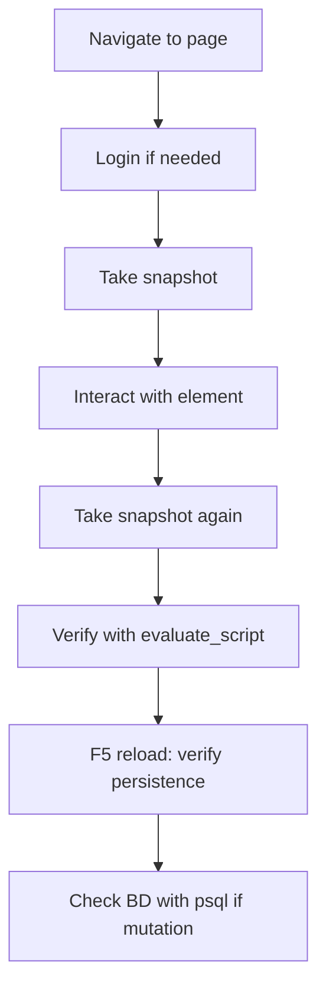

# SKILL: Chrome MCP Testing — COFAR SGD

> **Patrones y recetario para pruebas visuales con Chrome MCP (take_snapshot, take_screenshot, evaluate_script).**
> **Propósito:** Reducir el tiempo de pruebas eliminando la exploración manual de la UI. Mapeo fijo de elementos que nunca cambian.

---

## 1. Flujo base de prueba



---

## 2. Login (MAYA fija)

### 2.1 Login con usuario local
```javascript
// 1. Navigate to login
chrome-devtools_navigate_page type="url" url="http://localhost:8080/#/login"

// 2. El login puede redirigir automáticamente si ya hay sesión.
//    Hacer snapshot para ver estado actual.

// 3. Si está en la página de login, tomar snapshot y localizar inputs
//    username: input name="username" o similar
//    password: input type="password"
//    auth_source: radio buttons "Local/AD"

// 4. Llenar formulario
chrome-devtools_fill uid="<username_uid>" value="eto_test"
chrome-devtools_fill uid="<password_uid>" value="cofar.2026"
// Para radio button de auth_source, usar evaluate_script si es custom
chrome-devtools_evaluate_script function="() => document.querySelector('input[name=\"auth_source\"][value=\"local\"]')?.click()"

// 5. Click en login
chrome-devtools_click uid="<login_button_uid>"

// 6. Esperar redirección a home page
//    El login exitoso redirige a homeRoute del rol
```

### 2.2 Usuarios disponibles para pruebas

| Usuario | Password | Rol | auth_source |
|---|---|---|---|
| `eto_test` | `cofar.2026` | ETO | local |
| `admin_local` | `admin.2026` | ADMIN | local |
| `elaborador_revisor` | `cofar.2026` | ELABORADOR-REVISOR | local |
| `elab._revisor_aprob.` | `cofar.2026` | ELABORADOR-REVISOR-APROBADOR | local |
| `visualizador_cl` | `cofar.2026` | VISUALIZADOR | local |

### 2.3 Navegación login directa (sin UI)
Si ya hay sesión activa, la URL `/#/plantillas` carga directamente sin pasar por login.

---

## 3. Navegación sidebar (MAYA fija)

### 3.1 Rutas directas (sin navegar por sidebar)
```
/#/login              → Login
/#/bandeja            → Mi Bandeja (home de eto/user/visualizador)
/#/parametrizacion    → Parametrización (home de admin)
/#/plantillas         → Plantillas Documentales
/#/aprobacion-documento → Wizard creación documento
/#/version-editable   → Versión Editable
/#/lista              → Lista Maestra
/#/consulta           → Consultar Documentos
/#/liberacion-detalle → Atender Liberación
/#/revision           → Revisar Documento
/#/aprobacion-final   → Aprobación Final
/#/correccion         → Corregir Observaciones
/#/reportes           → Reportes
/#/chat               → Asistente IA
/#/pre-eval           → Pre-evaluación
```

### 3.2 Labels de navegación en snapshot
- "Mi Bandeja" → Bandeja
- "Plantillas Documentales" → Plantillas
- "Parametrización General" → Parametrizacion
- "Nueva Solicitud" → button que abre dropdown con 2 opciones
- "Lista Maestra" → ListaMaestra

---

## 4. Validación visual

### 4.1 Tomar snapshot + screenshot siempre
```javascript
// Snapshot para interactuar
chrome-devtools_take_snapshot

// Screenshot para evidencia visual (guardar en docs/PR/screenshots/)
chrome-devtools_take_screenshot filePath="docs/PR/screenshots/issue-X-descripcion.png"
```

### 4.2 Verificar estilos computados
No confiar solo en snapshot (a11y tree lista secuencial, no refleja layout visual).
```javascript
chrome-devtools_evaluate_script function="() => {
  const el = document.querySelector('selector');
  return getComputedStyle(el).gridTemplateColumns;
}"
```

### 4.3 Verificar textos exactos
El snapshot permite verificar que cierto texto aparece en la página.
Buscar en el snapshot por `StaticText "texto exacto"` o `heading "heading text"`.

---

## 5. Validación responsive

### 5.1 4 breakpoints obligatorios para issues responsive
```javascript
// Mobile (<640px)
chrome-devtools_resize_page width=375 height=812
// Tablet (768px)
chrome-devtools_resize_page width=768 height=900
// Desktop (1024px)
chrome-devtools_resize_page width=1024 height=768
// Large desktop (1280px+)
chrome-devtools_resize_page width=1280 height=800
```

### 5.2 Verificación en cada breakpoint
```javascript
// Verificar columnas del grid
const styles = getComputedStyle(el)
styles.gridTemplateColumns  // "# # # #" = 4 columnas, "#" = 1 columna

// Verificar visibilidad
styles.display  // "none" = oculto, "grid"/"block"/"flex" = visible
```

---

## 6. Validación de persistencia (F5)

```javascript
// Después de realizar una acción que persiste datos:
// 1. Ver estado actual
// 2. Hacer reload
chrome-devtools_navigate_page type="reload"
// 3. Esperar que cargue
// 4. Tomar snapshot
// 5. Verificar que el estado se mantiene
```

---

## 7. Validación en BD

Después de cualquier mutación (POST/PATCH/DELETE), verificar en BD:
```bash
docker exec sgd-postgres psql -U sgd -d sgd -c "SELECT * FROM tabla WHERE condicion;"
```

Tablas clave por feature:
| Feature | Tabla | Columna clave |
|---|---|---|
| Login | usuarios | username, es_usuario_ad |
| Ausencias | ausencias | usuario_id, fecha_desde, fecha_hasta |
| Ausencias | usuarios | ausente (flag) |
| Documentos | documentos | codigo, titulo, estatus |
| Wizard | documento_flujo | revisor_ids, aprobador_ids |
| Firma | firmas_digitales | resultado_exito |
| Plantillas | audit_log | accion='DOWNLOAD', recurso='plantilla_documental' |
| Sync AD | log_sincronizacion_ad | resultado, usuarios_creados |

---

## 8. Trucos para evitar problemas comunes

### 8.1 Snapshot fresco después de POST
```javascript
// DESPUÉS de click en botón que dispara POST, SIEMPRE:
chrome-devtools_take_snapshot
// Los uids anteriores ya no sirven
```

### 8.2 Evitar confirm() nativo
```javascript
// ANTES de click en botón destructivo:
chrome-devtools_evaluate_script function="() => { window.confirm = () => true; }"
```

### 8.3 Radio buttons custom
```javascript
// NO hacer click en el label visible
// Hacer click directo en el input radio:
chrome-devtools_evaluate_script function="() => document.querySelector('input[value=\"local\"]').click()"
```

### 8.4 Alpine $data para setear valores
```javascript
// Cuando fill() no funciona (date, checkbox):
chrome-devtools_evaluate_script function="() => {
  const root = document.querySelector('[x-data]');
  Alpine.$data(root).miVariable = 'nuevo valor';
}"
```

---

## 9. Roles y permisos (qué probar con cada rol)

| Feature | ADMIN | ETO | ELAB-REVISOR | VISUALIZADOR |
|---|---|---|---|---|
| Login | ✅ | ✅ | ✅ | ✅ |
| Parametrización | ✅ Todo | ✅ Catálogos | ❌ | ❌ |
| Bandeja | ✅ | ✅ | ✅ | ✅ |
| Wizard crear doc | ✅ | ✅ | ✅ | ❌ |
| Firmar doc | ✅ | ✅ | ✅ | ❌ |
| Sync AD | ✅ | ❌ (oculto) | ❌ | ❌ |
| Impersonate | ✅ | ✅ | ❌ | ❌ |
| Mi Perfil | ✅ | ✅ | ✅ | ✅ |
| Editar roles | ✅ | ✅ (no admin) | ❌ | ❌ |

---

## 10. Secuencia típica de validación de un fix

```javascript
// 1. Login con usuario apropiado
// 2. Navegar a la página afectada
// 3. Tomar screenshot ANTES (evidencia del bug)
// 4. Realizar la acción del fix
// 5. Tomar screenshot DESPUÉS (evidencia del fix)
// 6. Si hay mutación: verificar BD
// 7. F5 reload y verificar persistencia
// 8. Si hay tests: correr pytest
// 9. Reportar al usuario: "Así lo validé: [pasos]. Así podés validarlo vos: [pasos manuales]"
```
